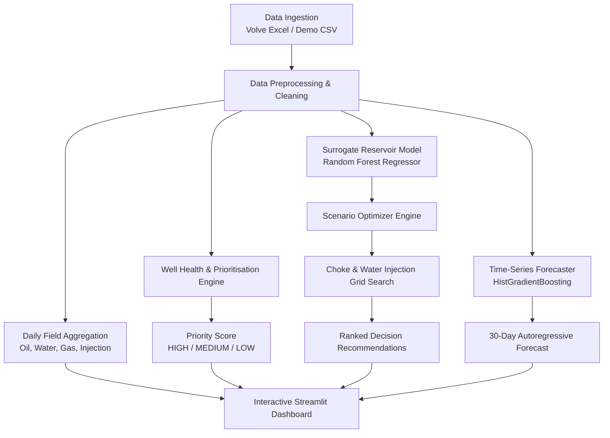

# 🛢️ MATURE-X: AI-Assisted Mature-Field Production Optimiser & Decision Support

[](https://www.python.org/)
[](https://streamlit.io/)
[](https://scikit-learn.org/)
[](https://www.equinor.com/energy/volve-data-sharing)

**MATURE-X** is an end-to-end reservoir and production engineering decision-support tool tailored for mature hydrocarbon fields. As brownfields approach economic cut-off, operators face escalating water cuts, depleted downhole pressures, and complex choke-lift-injection trade-offs. 

This repository provides an automated, data-driven workflow that diagnoses well health, forecasts production decline, runs what-if optimization scenarios (choke vs. water injection), and delivers actionable recommendations through an interactive dashboard.

---

## 📑 Table of Contents
1. [System Architecture & Workflow](#-system-architecture--workflow)
2. [Folder Structure](#-folder-structure)
3. [Component Breakdown](#-component-breakdown)
   - [1. Data Pipeline (`src/data.py`)](#1-data-pipeline-srcdatapy)
   - [2. Machine Learning & Surrogate Engine (`src/models.py`)](#2-machine-learning--surrogate-engine-srcmodelspy)
   - [3. What-If Scenario Optimiser (`src/optimizer.py`)](#3-what-if-scenario-optimiser-srcoptimizerpy)
   - [4. Interactive Decision Dashboard (`app.py`)](#4-interactive-decision-dashboard-apppy)
4. [Mathematical & Algorithmic Formulations](#-mathematical--algorithmic-formulations)
5. [Volve Field Benchmark & Results](#-volve-field-benchmark--results)
6. [Data Sources & Modes](#-data-sources--modes)
7. [Installation & Quick Start](#-installation--quick-start)
8. [Engineering Honesty & Physical Simulator Disclaimer](#-engineering-honesty--physical-simulator-disclaimer)

---

## 🏛️ System Architecture & Workflow



---

## 📂 Folder Structure

```
MATURE-X/
│
├── data/
│   ├── raw/
│   │   └── Volve production data.xlsx   # Official Equinor Volve daily production workbook (~2.3 MB)
│   └── demo/
│       └── demo_production.csv          # Self-contained synthetic fallback dataset (610 records)
│
├── src/
│   ├── __init__.py                      # Python package marker
│   ├── data.py                          # Data ingestion, field aggregation, well prioritisation, features
│   ├── models.py                        # ML forecaster, surrogate Random Forest model, 30-day projection
│   └── optimizer.py                     # What-if scenario grid search, penalty scoring, ranking
│
├── app.py                               # Main Streamlit web application & decision dashboard
├── requirements.txt                     # Core dependencies (streamlit, pandas, scikit-learn, plotly)
└── README.md                            # Comprehensive technical documentation
```

---

## 🔍 Component Breakdown

### 1. Data Pipeline (`src/data.py`)
Responsible for reading raw field data, standardizing schemas, imputing missing sensor measurements, and deriving reservoir metrics.
* **`load_data()`**: Automatically detects if `data/raw/Volve production data.xlsx` is present. If found, reads the `Daily Production Data` sheet, cleans column names, calculates water cut, resolves water injection from injector wells, and forward/backward fills missing bottom-hole gauge pressures. If the workbook is absent, falls back to `data/demo/demo_production.csv`.
* **`field_daily(df)`**: Aggregates production at the reservoir field level by date (`oil_rate`, `water_rate`, `gas_rate`, downhole pressure, and field water injection).
* **`well_summary(df)`**: Computes cumulative oil production, average rate, latest active production rate, water cut, decline percentage, and generates an automated **Well Health Score** and **Intervention Priority**.
* **`features_for_well(df, well)`**: Prepares temporal feature matrices for machine learning, including 7-day and 30-day lags, rolling 7-day and 30-day moving averages, pressure metrics, choke percentage, water injection, water cut, and chronological day index.

### 2. Machine Learning & Surrogate Engine (`src/models.py`)
Provides both time-series decline forecasting and non-linear surrogate modeling of the well operating envelope.
* **`train_forecaster(well_df)`**: Trains a `HistGradientBoostingRegressor` on the well's historical time series using an 80/20 chronological split. Computes holdout validation metrics (**MAE** and **MAPE**).
* **`forecast_30d(well_df, model, days=30)`**: Performs a 30-day autoregressive roll-forward forecast using lag and rolling feature updates for future dates.
* **`build_surrogate(df)`**: Fits a multi-variable `RandomForestRegressor` with 250 trees to model the non-linear relationship between operating controls and hydrocarbon output:
  $$\log(1 + \text{oil\_rate}) \approx f(\text{pressure\_bar}, \text{choke\_pct}, \text{water\_injection}, \text{water\_cut})$$
* **`surrogate_predict(model, pressure, choke, injection, water_cut)`**: Predicts oil rate for candidate operating points using the trained surrogate.

### 3. What-If Scenario Optimiser (`src/optimizer.py`)
Explores adjustments to operating setpoints to identify uplift opportunities while penalizing excessive water production and drastic operational changes.
* **`scenarios(model, current, n=0)`**: Evaluates a 2D parameter grid:
  * **Choke adjustments ($\Delta c$)**: $[-10\%, -5\%, 0\%, +5\%, +10\%]$
  * **Water injection adjustments ($\Delta i$)**: $[-15\%, -8\%, 0\%, +8\%, +15\%]$
* Models the physical response proxy where higher water injection provides pressure support but risks increasing water cut, while choke choking restricts rate but stabilizes drawdown.
* Calculates predicted oil uplift, water cut penalty, and operational friction penalty to output a ranked list of candidate scenarios with objective decision scores.

### 4. Interactive Decision Dashboard (`app.py`)
Streamlit interface rendering real-time engineering insights:
* **Sidebar Controls**: Select producer well and tune the forecast horizon (7 to 60 days).
* **KPI Metrics**: Real-time cards displaying Current Oil Rate ($\text{Sm}^3/\text{d}$), Water Cut ($\%$), Downhole Pressure ($\text{bar}$), and AI Priority.
* **Field & Well Plots**: Interactive Plotly charts for field-wide production trajectories and producer historical oil/water curves.
* **AI Recommendation Card**: Optimal choke and injection changes with predicted uplift percentage and pressure shift.
* **Scenario Ranking Table**: Top 6 ranked operational interventions with choke $\Delta\%$, injection $\Delta\%$, predicted oil gain $\%$, water cut, and score.
* **Well Prioritisation Matrix**: Overview table ranking all producers by health score and intervention urgency.
* **AI Forecast Curve**: Plot showing historical production transitioning into the 30-day ML forecast with validation MAE/MAPE captions.
* **Data Mode Status**: Clear footer indicator noting whether the app is using the raw Volve workbook or synthetic fallback.

---

## 🧮 Mathematical & Algorithmic Formulations

### 1. Water Cut Calculation
$$\text{Water Cut} = \frac{q_w}{q_o + q_w}$$
Where $q_w$ is daily water volume ($\text{Sm}^3/\text{d}$) and $q_o$ is daily oil volume ($\text{Sm}^3/\text{d}$).

### 2. Well Health Score & Intervention Priority
The health score quantifies production degradation based on historical decline and current water burden:

$$\text{Decline}\% = \max\left(0, \left(1 - \frac{q_{o,\text{latest}}}{\bar{q}_o}\right) \times 100\right)$$

$$\text{Health Score} = \text{clip}\left(100 - 0.55 \times \text{Decline}\% - 45 \times \text{Water Cut}, 0, 100\right)$$

**Priority Classification:**
| Health Score Range | Classification | Action / Recommendation |
| :--- | :---: | :--- |
| $\text{Health} < 45$ | **HIGH** | Candidate for immediate intervention, water shut-off, or choke review. |
| $45 \le \text{Health} \le 70$ | **MEDIUM** | Monitor closely; moderate decline or rising water cut. |
| $\text{Health} > 70$ | **LOW** | Well is stable and performing well within baseline. |

### 3. Scenario Scoring Objective Function
When searching candidate scenarios, the objective function balances oil uplift against water handling costs and operating wear:

$$\Delta\text{Oil}\% = \frac{\hat{q}_{o,\text{scen}} - q_{o,\text{base}}}{\max(q_{o,\text{base}}, 1)} \times 100$$

$$\text{Penalty}_{\text{water}} = \max\left(0, \hat{w}_{\text{cut}} - w_{\text{cut},\text{base}}\right) \times 100$$

$$\text{Penalty}_{\text{change}} = |\Delta c\%| \times 0.12 + |\Delta i\%| \times 0.06$$

$$\text{Score} = \Delta\text{Oil}\% - 0.7 \times \text{Penalty}_{\text{water}} - \text{Penalty}_{\text{change}}$$

---

## 📊 Volve Field Benchmark & Results

When evaluated on the Equinor Volve dataset (`data/raw/Volve production data.xlsx`):

* **Field Totals**: $10,037,080.6\text{ Sm}^3$ cumulative oil; $15,318,523.5\text{ Sm}^3$ cumulative water; $1,475,369,837.3\text{ Sm}^3$ gas across 2,962 producing days.
* **Surrogate Model**: Trained on 8,008 producer records ($R^2$-optimized Random Forest). Feature importances:
  * Water Cut: `49.69%`
  * Choke Size: `28.84%`
  * Downhole Pressure: `14.65%`
  * Field Water Injection: `6.82%`

### Well Prioritisation Summary
| Well Name | Cumulative Oil ($\text{Sm}^3$) | Latest Active Rate ($\text{Sm}^3/\text{d}$) | Water Cut (%) | Health Score | Priority |
| :--- | :---: | :---: | :---: | :---: | :---: |
| **`15/9-F-14`** | 3,942,233.4 | 68.5 | 96.5% | **4.2** | **HIGH** |
| **`15/9-F-12`** | 4,579,609.5 | 104.8 | 89.4% | **8.4** | **HIGH** |
| **`15/9-F-11`** | 1,147,849.1 | 180.0 | 83.3% | **17.2** | **HIGH** |
| **`15/9-F-1 C`** | 177,709.3 | 208.0 | 72.3% | **40.2** | **HIGH** |
| **`15/9-F-15 D`**| 148,518.6 | 106.3 | 59.4% | **48.5** | **MEDIUM** |
| **`15/9-F-5`** | 41,160.7 | 327.2 | 19.2% | **91.4** | **LOW** |

---

## 💾 Data Sources & Modes

The application features seamless zero-configuration fallback:

1. **Real Data Mode (Active)**:
   - File: `data/raw/Volve production data.xlsx`
   - Source: Equinor Volve Open Data licence (North Sea Block 15/9).
   - Contains real pressure, choke, water injection, and multi-phase production rates.
2. **Demo Mode (Fallback)**:
   - File: `data/demo/demo_production.csv`
   - Generated synthetic dataset mimicking typical decline curves.
   - Activated automatically if the raw Excel file is removed.

---

## 🚀 Installation & Quick Start

### 1. Prerequisites
* Python 3.9 through 3.12 installed.
* Virtual environment recommended.

### 2. Install Dependencies
```bash
# Clone or navigate to the repository
cd d:/MATURE-X/MATURE-X

# Install required packages
pip install -r requirements.txt
```

### 3. Launch the Application
```bash
streamlit run app.py
```
Open **[http://localhost:8501](http://localhost:8501)** in your browser.

---

## ⚖️ Engineering Honesty & Physical Simulator Disclaimer

> **⚠️ IMPORTANT RESERVOIR ENGINEERING NOTICE**  
> The scenario optimization engine in MATURE-X is a **data-driven surrogate model** built with non-linear machine learning regressors. 
> * It is designed for decision support, screening, and rapid operational what-if demonstration.
> * It is **NOT** a validated, physics-based, numerical reservoir simulator (e.g., ECLIPSE, CMG, or tNavigator) and does not solve full compositional or black-oil material balance PDE grids.
> * Scenario recommendations should always be validated against geological models, well inflow performance relationships (IPR/VLP), and facility constraints before implementing field setpoint changes.
